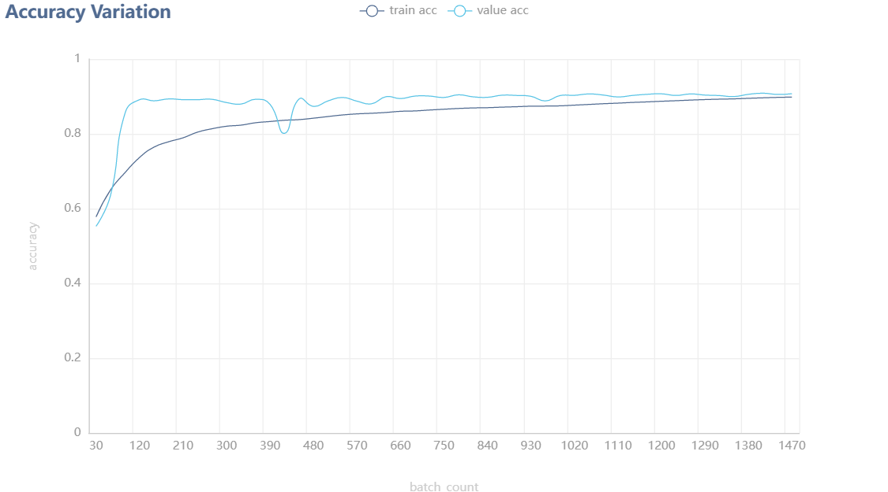
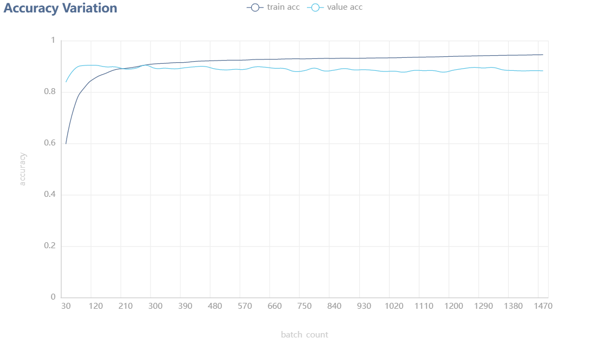
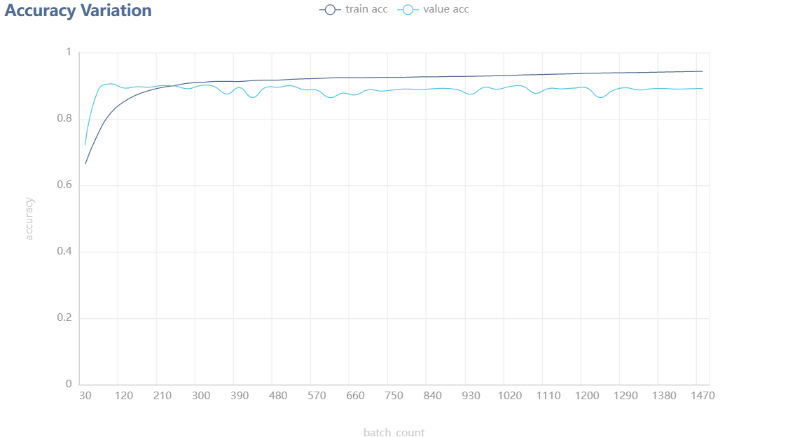

## 项目介绍

NLP学习项目

本项目基于Bert模型并且将Bert模型与TextCNN、TextRNN模型进行结合，对中文外卖买家的评论文本数据进行情感分类，分为2种类别。

This project is based on Bert model and combines Bert model with TextCNN and TextRNN models to classify Chinese takeaway buyers' review text data into 2 categories.


### 预训练模型介绍

| 模型         |                             介绍                             |
| ------------ | :----------------------------------------------------------: |
| bert         | 此处使用的是Pre-Training with Whole Word Masking for Chinese BERT，出处：[ymcui/Chinese-BERT-wwm: Pre-Training with Whole Word Masking for Chinese BERT（中文BERT-wwm系列模型） (github.com)](https://github.com/ymcui/chinese-bert-wwm) |
| bert+TextCNN |         使用bert模型最后一层输出接入TextCNN进行卷积          |
| bert+TextRNN |               使用bert模型最后一层输出接入LSTM               |


### 训练与测试数据集

项目训练与测试所用的中文外卖评论数据集来自[SophonPlus/ChineseNlpCorpus: 搜集、整理、发布 中文 自然语言处理 语料/数据集，与 有志之士 共同 促进 中文 自然语言处理 的 发展。 (github.com)](https://github.com/SophonPlus/ChineseNlpCorpus)

数据集经过筛选处理后，最终包括6000条评论数据用于模型的训练，3000条评论用于模型的测试评估，文本长度大部分在50字以内，少数大于50字，在训练与评估时所有数据将被随机打乱。


The Chinese takeaway review dataset used for the training and evaluation of the project was obtained from   

https://github.com/SophonPlus/ChineseNlpCorpus

The data set is filtered and processed, and finally includes 6000 comments data for model training and 3000 comments for model testing and evaluation. The text length is mostly within 50 words, and a few are larger than 50 words, and all data will be randomly disrupted during training and evaluation.


### 环境依赖

``` shell
python3.8
pip install pandas==1.5.2
pip install numpy==1.23.5
pip install scikit-learn==1.1.3
pip install torch
pip install torchvision
pip install tqdm==4.64.1
pip install transformers==4.25.1
pip install pyecharts==1.9.1
```


### 训练效果

训练时设置的epoch数为3轮，batchSize设置为12，每30Batch进行一次模型评估，分别统计当前训练与评估时的ACC、LOSS、F1与AUC值。


##### 最终训练集结果

| 模型         |  acc   |  loss  |   f1   |  auc   |
| ------------ | :----: | :----: | :----: | :----: |
| bert         | 0.8983 | 0.2517 | 0.8735 | 0.8903 |
| bert+TextCNN | 0.9448 | 0.1524 | 0.9334 | 0.9422 |
| bert+TextRNN | 0.9430 | 0.1766 | 0.9302 | 0.9385 |


##### 最终测试集结果

| 模型         |  acc   |  loss  |   f1   |  auc   |
| ------------ | :----: | :----: | :----: | :----: |
| bert         | 0.9073 | 0.2772 | 0.9046 | 0.9073 |
| bert+TextCNN | 0.8823 | 0.3995 | 0.8756 | 0.8823 |
| bert+TextRNN | 0.8916 | 0.3745 | 0.8870 | 0.8916 |

从当前测试集的结果来看，原始的chinese_bert模型的效果要比其它两种稍好，说明原始的chinese_bert模型效果已经很不错了，其他两种模型的接入效果跟原始的模型对比没有什么提升。

From the results of the current test dataset, the effect of the original chinese_bert model is slightly better than the other two models, which means that the effect of the original chinese_bert model is already very good, and the effect of the other two models is not much improved compared with the original model.


#### bert_acc



#### bert_TextCNN_acc



#### bert_TextRNN_acc



### 运行说明

``` shell
python train.py modelIndex
modelIndex=0 表示使用原始chinese_bert模型
modelIndex=1 表示使用原始chinese_bert+TextCNN模型
modelIndex=2 表示使用原始chinese_bert+TextRNN模型
```


数据集在dataset目录下

训练保存的模型在model目录下

原始chinese_bert模型在chinese_wwm_ext_pytorch目录下，此处因文件大小过大未提供，可直接去上面的出处链接下载.

在运行其他训练选项之前, 需要先跑一遍原始chinese_bert模型得到bert_model_train.pth.

测试数据结果在result目录下，绘制的图表数据结果在charts目录下
